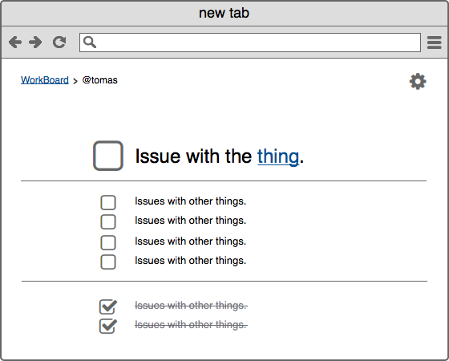

I've heard multiple say that creating a chrome extension is about as easy as creating a static web page. Is it really? Here's a step-by-step on how I created my first Trello-integrated chrome extension, almost like a simple and developer-friendly version of [Momentum](https://momentumdash.com/).

### **What kind of extension?**

First off, I want to override Chromes _new tab_ page. New Tab, Bookmarks and History can be overridden with your own version of those pages. For example, [Momentum](https://chrome.google.com/webstore/detail/momentum/laookkfknpbbblfpciffpaejjkokdgca?hl=en) is a custom New Tab extension, while [Bookmark Manager](https://chrome.google.com/webstore/detail/bookmark-manager/gmlllbghnfkpflemihljekbapjopfjik/related?hl=en) (not surprisingly) replaces your Bookmarks page. This differs from most extensions, which extend Chrome capabilities. For example, [Save To Pocket](https://chrome.google.com/webstore/detail/save-to-pocket/niloccemoadcdkdjlinkgdfekeahmflj?hl=en) adds a button that allows you to save the page in your [Pocket](https://getpocket.com/a/) list (given that you have an account there), and [Vimium](https://chrome.google.com/webstore/detail/vimium/dbepggeogbaibhgnhhndojpepiihcmeb?hl=en) gives you the capability to navigate a webpage easily by only using your keyboard. A new tab page is actually provided by Google as an example, right [here](https://developer.chrome.com/extensions/samples#blank-new-tab-page). There's also a bunch of other helpful examples, like [google-document-list-viewer](https://developer.chrome.com/extensions/samples#google-document-list-viewer) which uses OAuth to access your Google Documents or [google-mail-checker](https://developer.chrome.com/extensions/samples#google-mail-checker) to check your Gmail. These give examples of how to do common operations and how to use the [Chrome API](https://developer.chrome.com/extensions/api_index).

### Part 1: See how it works

1.  Download [blank-new-start-page sample](https://developer.chrome.com/extensions/samples#blank-new-tab-page)
2.  Go to your [Chrome extensions page](chrome://extensions/) and select Developer Mode.
3.  Select Load Unpacked extension, and choose the folder you downloaded the sample from. 

**Tada!** You've got the extension, and you can check that it works by opening a new tab: 

### Part 2: Making functionality

So I'm thinking I'd like to see a specific board from Trello, optionally with a filter, with the topmost matching ticket in extra large fonts, to keep my head focused on that task. Something like this: 

 

> So it's basically a [todomvc](http://todomvc.com/) with a trello integration?

> – Yes, that's exactly what it is! 

> Well, can I use my favorite framework, like React + Redux, Angular or Ember, pack it with Webpack, and just use that?

> – Sure. There's nothing stopping you!

Remember that it'll pop up every time you open a new tab, so I'd say it's perfectly acceptable to write some plain old ES5 JavaScript without any libraries or frameworks, in order to get the best performance. But whatever you like – this is suppose to be fun after all! 

But the base line is: **Just create any frontend app**. As long as it's only static files (or compiled to it), it's OK to be a start-page extension.

### Part 3: Fix up manifest.json

My manifest.json looks something like this:

```json
{
  "name": "2rello start tab",
  "description": (
     "Your favorite trello board "
     "as a beautiful start tab"
  ),
  "version": "0.2",
  "incognito": "not_allowed",
  "chrome_url_overrides": {
    "newtab": "index.html"
  },
  "manifest_version": 2
}
```

You should put in `manifest_version: 2`. Name and version is [required](https://developer.chrome.com/extensions/manifest), while `chrome_url_overrides` is what tells chrome to use this app as the start page. For a full list of options, check out [Manifest doc](https://developer.chrome.com/extensions/manifest)

### Frequently Asked Questions

#### Where can I see the extension you made?

[https://github.com/tomfa/chrome-app-demo](https://github.com/tomfa/chrome-app-demo)  

#### How do I make those non-start page extensions?

For those non-start page extensions (i.e. the Pocket-button), there's many other guides, e.g:

*   [SitePoint - How to Create a Chrome Extension in 10 minutes flat](https://www.sitepoint.com/create-chrome-extension-10-minutes-flat/)
*   [LifeHacker - How to build a chrome extension ](http://lifehacker.com/5857721/how-to-build-a-chrome-extension)
*   [Thoughtbot - How to make a chrome extension](https://robots.thoughtbot.com/how-to-make-a-chrome-extension)

#### How do I publish my extension to Chrome Store?

Check out [https://developer.chrome.com/webstore/publish](https://developer.chrome.com/webstore/publish)

#### How's Chrome Apps different?

Chrome Apps are not the same as extensions. Chrome Apps are basically regular web applications. The difference is that

1.  You **can** **avoid hosting it**, allowing it to live in the browser of the user that installed it (given that it's small enough).
2.  You **can** **make use of Chromes API** (given that you don't host it yourself).
3.  New Apps can **only be installed on Chrome OS PC**s. [Not on Windows, Mac or Linux (anymore](https://blog.chromium.org/2016/08/from-chrome-apps-to-web.html)).

Due to that last one, I haven't mentioned it before, and will probably not mention Apps much ever again.

* * *

**Links:**

*   [Chrome Developer - Getting started](https://developer.chrome.com/extensions/getstarted)
*   [Chrome Developer - Manifest File Format](https://developer.chrome.com/extensions/manifest)
*   [Chrome Developer - Override Pages](https://developer.chrome.com/extensions/override)
*   [Chrome Developer - Examples](https://developer.chrome.com/extensions/samples)
