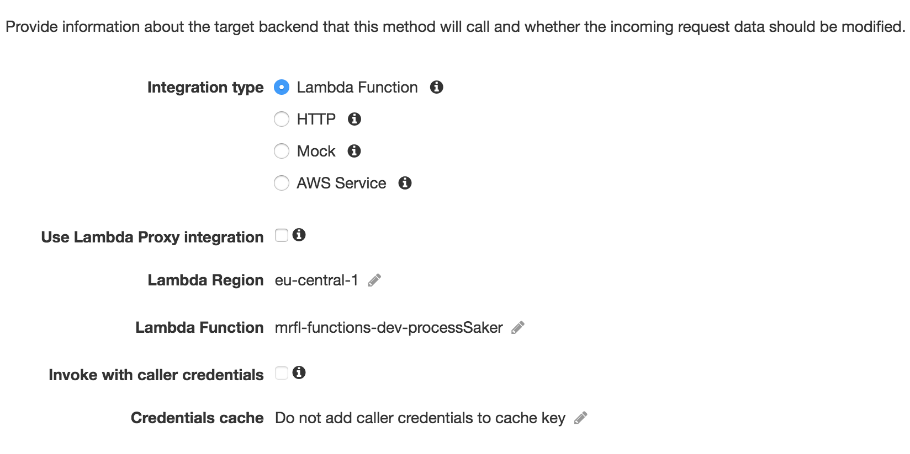
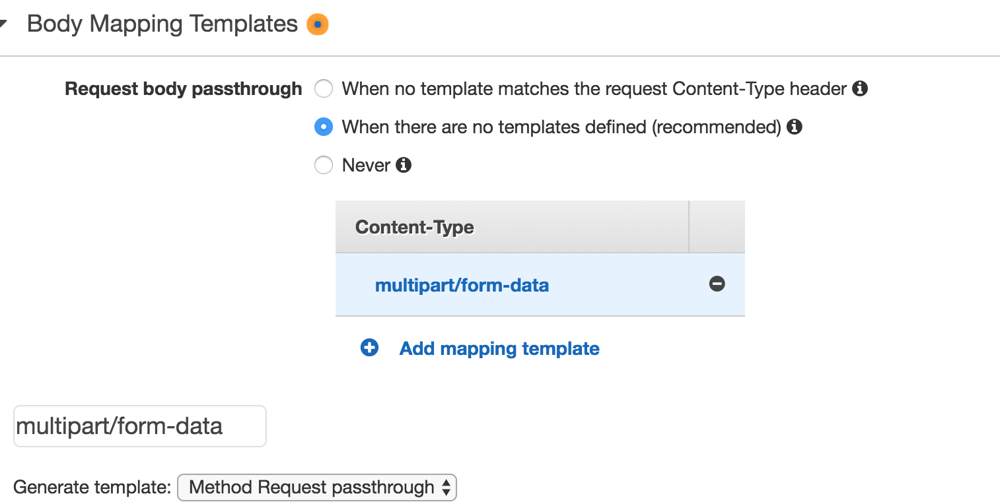
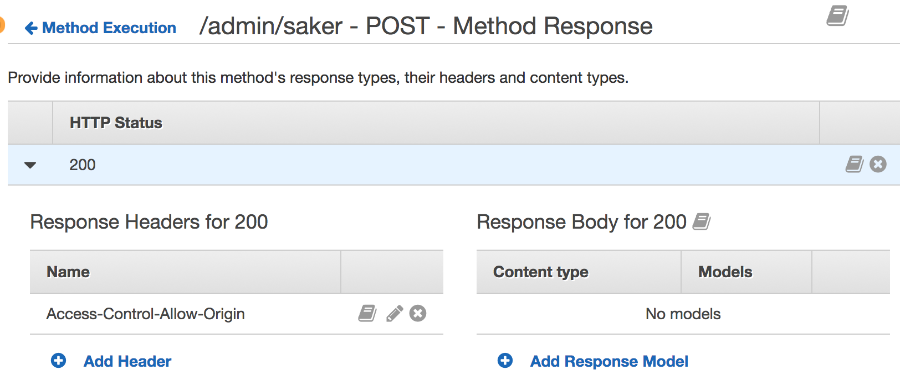

Create an AWS Lambda function with Python3 and integrate with S3? Simple if you know how (though getting there is a bitch, I bet Amazon does this on purpose as a way to trick developers in on their certification-ride). I found how, copy-paste below. _Note: These are set up with [serverless](https://serverless.com/), which is an awesome tool. If you're a Cloudformation/Terraform-user, I bet you'll figure it out from the .yml-file._ **Simple hello world response** https://gist.github.com/tomfa/22f2a1f7567377d6fbfcd5ce5106642d **Simple function that will write to S3** https://gist.github.com/tomfa/7bb519a34262353087a83712539eb6b0 **Simple function that will accept .csv and save .json to S3** This one is more tricky! We can [add an API-Gateway as an S3 proxy](http://docs.aws.amazon.com/apigateway/latest/developerguide/integrating-api-with-aws-services-s3.html), and fire a trigger lambda after the upload. That is probably also the advisable thing to do. If you persist in going in the wrong direction on this, you can end up solving it like this:

1.  Deploy this serverless: [https://gist.github.com/tomfa/87947d2773b60fc3797491d6ef5e3d0e](https://gist.github.com/tomfa/87947d2773b60fc3797491d6ef5e3d0e)
2.  Realize shits not working, and manually set API-Gateway endpoint to accept blobs (this annot be done in serverless):
    *   **First, remove "Use Lambda Proxy integration** 
    *   **Scroll down and accept multipart data, then Save** 
    *   **Navigate to Method Execution (on API Gateway endpoint) and allow HTTP 200 responses** _(what? this seems weird)_ 
